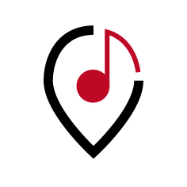
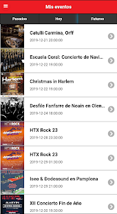
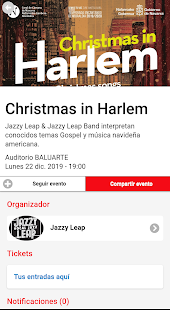
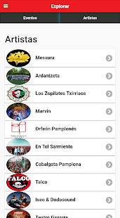
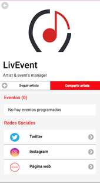

<h1 align="center">
<a href="https://play.google.com/store/apps/details?id=es.livevent.tlm">livEvent</a>
 

</h1>

Aplicación para gestión de eventos y red social para promoción de artistas 🎵
===

livEvent es la aplicación que gestiona eventos de todo tipo, promocionándolos y permitiendo una mejora en la interacción usuario-artista. La red social definitiva de artistas locales que buscan promocionar sus eventos y el de los usuarios que buscan seguirlos sin perderse ninguna de sus actuaciones.

===

- Sigue tus artistas y eventos locales favoritos. 

- Descubre artistas locales, puedes ver su perfil, sus próximos actuaciones, dónde comprar sus entradas y más...

- Descubre nuevos eventos que ocurren cerca de ti, se acabaron los fines de semana sin planes. 

- Podrás opinar que te ha parecido el evento que has acudido con una encuesta que desplega livEvent.

- ¿ERES ARTISTA? Este es tu sitio. Promocionate creandote un perfil en LIVEVENT ¡¡tardas 1 minuto!!

Made by Oscar del Rio (delrio.107420@e.unavarra.es), [Tomás Hernández](https://github.com/Tomas-H-Quintanilla) and [Fermín Lassa](https://github.com/lassa97)
